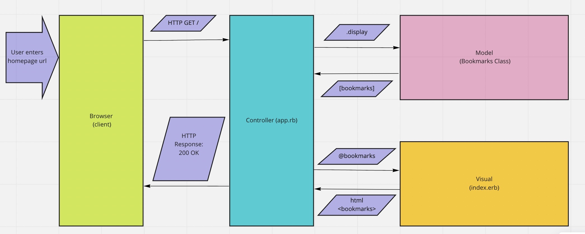

# Specifications/User Stories
1. Show a list of bookmarks:
As a web surfer,
So that I can save time,
I'd like to see a list of bookmarked pages

1. Add New Bookmarks:
As a web surfer,
So that I can remember interesting sites I've visited,
I'd like to see add new bookmarks

Database Setup
--------------
1. Connect to psql
2. Create the database using the psql command CREATE DATABASE bookmark_manager;
3. Connect to the database using the pqsl command \c bookmark_manager;
4. Run the query we have saved in the file 01_create_bookmarks_table.sql